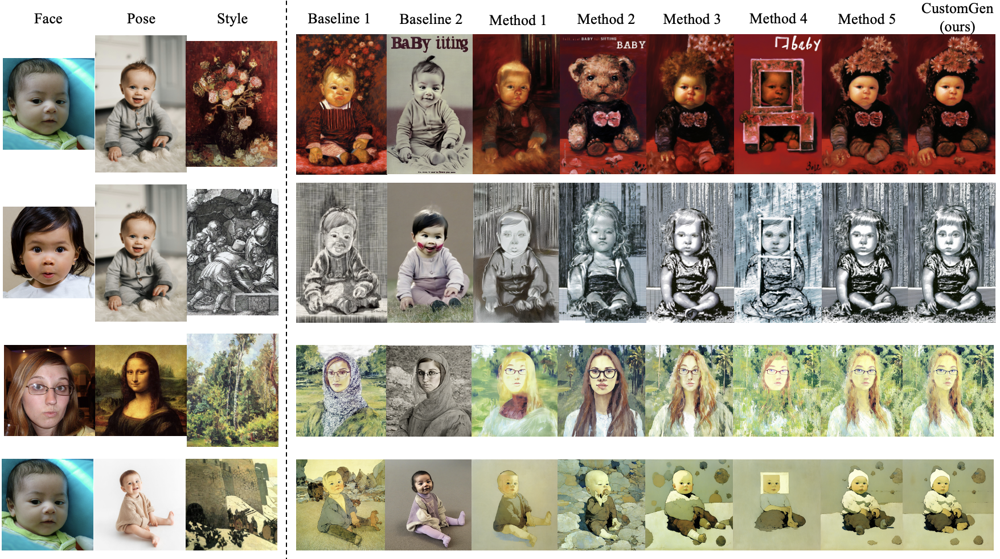

<h1 align="center"> CustomGen: Towards Training-Free Custom Generation <br>
  with Unified Multimodal Conditioning </h1>
<h4 align="center"> If you like our project, please give us a star ⭐ on GitHub. </h4>

This repository contains official code implementation of "CustomGen: Towards Training-Free Custom Generation". We provide the inference code reported in the paper.
<p align="center">
    <br>
</p>

<h2>Abstract</h2>

<h2>Getting Started</h2>
<h3>1) Clone the repository</h3>

```bash  
git clone CustomGen
cd CustomGen
```

<h3>2) Download Models</h3>

<h3>3) Environment Setup</h3>

```bash
conda create --name customgen python=3.8.10
conda activate ConsistentID

# Install requirements
pip install -r requirements.txt
```

<h2>Usage</h2>

<h2>Citation</h2>
If you find CustomGen useful for your research and applications, please cite us using this BibTeX:
